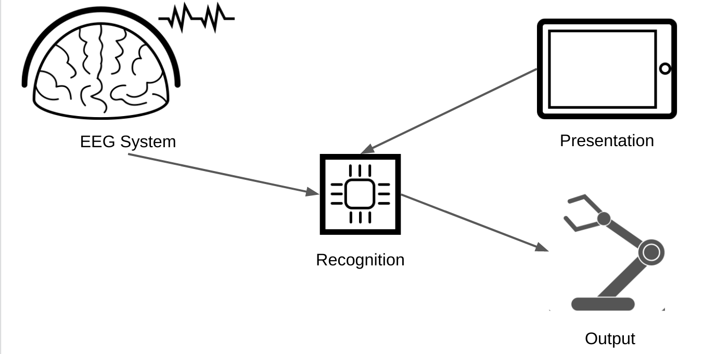
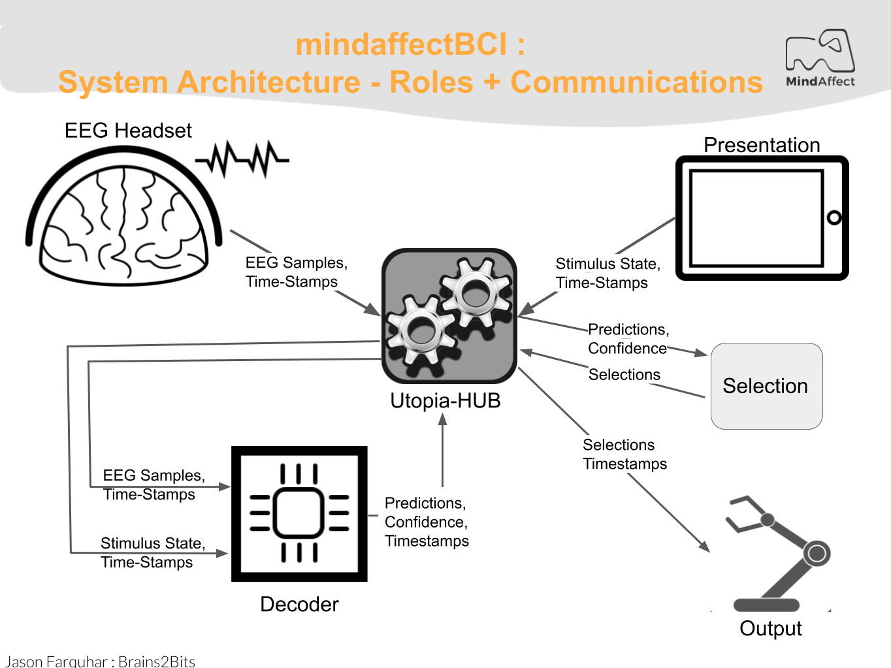

## mindaffectBCI : System Overview and Component Roles

## System Overview

The mindaffect BCI is a Brain Computer Interface (BCI) system which allows users to control computers and other electronic devices by looking at flickering objects.  As each object has a unique flicker sequence, by measuring the brain's response to this unique sequence the BCI can identify the target object the user is looking at and hence cause that object to be selected.  

In the BCI literature this type of BCI is called a visual evoked-response BCI, as the brain response (which we use) is generated (or evoked) by the visual flickering of the target object.  Below is an illustration of how a classic evoked response BCI works schematically:

To briefly describe this schematic:

1. Presentation: displays a set of options to the user, such as pickup, drop, and stop.
2. Each of these options then flickers with a given unique flicker sequence (or stimulus-sequence) with different objects getting bright and dark at given times.
3. The user, looks at the option they want to select to select that option.
4. The users brain response to the presented stimulus is measured by EEG - due to the users focus on their target object, this EEG signal contains information on the flicker-sequence of the target object.
5. The recognition system uses the measured EEG and the known stimulus sequence to generate predictions for the probability of the different options being the users target option.
6. Finally, the selection and output system decides when the prediction is confident enough to select an option and generate the desired output -- dropping something in this case.  

There are many types of (visual) evoked response BCI, all of which work in basically the same fashion.  What may differ is the modality in which the stimulus is presented (such as visually, orally, or tactically) and/or the particular properties of the ‘flicker’ pattern and associated brain response.

The Utopia system uses a particular ‘flicker’ pattern based on pseudo-random-noise codes, specifically gold-codes, which cause the brain to generate a Visual Evoked Potential.  In the BCI literature this type of BCI is called a code-based Visual Evoked Potential (c-VEP).

### Physical components of the mindaffect BCI

The main physical components of the mindaffect BCI are illustrated below:

The 4 main components and their purpose are:

*   **Presentation**: This component is usually a screen of some sort, e.g. LCD, or tablet-computer, but may be any system which is able to generate a rapid controlled visual change, such as an LED array or a laser-pointer.  The purpose of this component is to present the selectable objects and ‘flicker’ them in the required sequence such that when the user looks at their _target object_ (that is the object they want to select) a detectable brain response is evoked. It must also send information on the actual flicker sequence of each object to the Reogniser so it can identify the users target object. 
*   **EEG system:** This component usually consists of 3 sub-components: a) a headset that sits on the users head and ensures a physical connection between the measurement electrodes and the users scalp. b) an amplifier which measures the relevant brain response and converts it into digital signals, c) a transmission system (such as USB, WiFI or Bluetooth) which can send these measurements to the Decoder so it can identify the users target object. 
*   **Recogniser** or **Decoder** : This component is the physical host of the software that runs the machine learning algorithms and combines the information on the presented stimulus (from the Presentation component) and the measured brain response (from the EEG component) to **recognise** the users intended target and send these **object selections** to the output component.   Usually, this component is physically a single-board computer, such as a raspberry pi, but may be a purely software component running on the CPU of another component (such as CPU of a tablet or desktop computer used for presentation).
*   **Output**: In many cases this component is integrated as part of the presentation component, such as a tablet-computer, but may be a completely independent device, such as a robot or TV, or home-automation device (e.g. door opener/closer.)   The purpose of this device is to take the **object selections** generated by the Decoder and generate the desired output.  For example, in a virtual-keyboard application this may be to add the selected letter to the current sentence, or in a home-automation setting this may be to change to the selected TV channel or open the indicated door.

### Functional roles of the Utopia BCI

The physical components of the Utopia BCI map fairly straightforwardly onto the functional roles within the utopia system. The below diagram illustrates the main functional roles of the Utopia system and the communication messages used to communicate between them.  The arrows indicate the direction of information flow between components.

The main functional roles in the utopia system are:

*   **Presentation:** The presentation component is responsible for presenting the stimuli to the user, and sending information about this presentation to the **Decoder** so it can identify the users selected target.  How the presentation is actually performed is up to the presentation component.  In particular the stimulus modality (visual, audio, tactile) and flicker sequence used are the responsibility of the presentation system. 

    The stimulus information is sent to the decoder using **Utopia Message-spec** messages (see the Utopia Message-spec for details) using **STIMULUSEVENT** messages.   The particular transport used for the messages will depend on the hardware implementation, but currently we use TCP-IP sockets over WIFI.   For ease of implementation we provide example presentation implementations with both cVEP stimulus display and TCP-IP based message sending in the following development languages/frameworks on our [github page](github.com/mindaffect/) :
    *   SWIFT/iOS
    *   Unity
    *   Python, with pygame
    *   Java, with libGDX
    *   MATLAB/OCTAVE

*   **EEG Acquisition:** The EEG acquisition system is responsible for getting digital EEG samples from the EEG hardware and transmitting them to the **Decoder**.

    This information is transmitted to the decoder in a number of different formats, for example via. [Lab Streaming Layer](https://github.com/sccn/labstreaminglayer).  The mindaffect BCI primarly uses [brainflow](brainflow.org) to interact with the acquisation hardware, and then uses a network-transparent message-specification, see , to forward this data to the **Utopia-Hub**. 

*   **Utopia-Hub**: This component is responsible for connecting together all the other components of the system.  Basically, this is a broker for Utopia Message Spec messages, which accepts incoming messages and forwards them between different clients, for example forwarding all STIMULUSEVENT messages from Presentation clients to the Decoder component and in turn forwarding all PREDICTEDTARGETPROB messages from the Decoder to all output or selection clients.

    The Utopia-Hub is a purely software component running on the same platform as the Decoder.  The particular transport used for the messages depends on hardware, but the current system uses TCP-IP sockets over WIFI or Ethernet.  In particular the Utopia-Hub allows incoming and outgoing client connections on **TCP port 8400** and **incoming only** connections on **UDP port 8400**.

    The utopia-hub also includes additional functionality making it easier to use and debug the utopia-system including;

    *   Sending and monitoring **HEARTBEAT** messages from and to clients.  These messages are sent a regular intervals to check for liveness of the clients within the utopia-hub and to detect hub crashes within clients.
    *   Providing auto-discovery services, via Simple Service Discovery (SSDP) to allow automatic detection of the utopia-hub from clients.

    As the Utopia-Hub is an internal component to the Decoder component, it’s actual operation is not discussed further here.  (Though FYI: it is a single-threaded network server implemented in JAVA).

    For ease of implementation in clients we provide a full implementation of utopia-hub **CLIENTS** including auto-discovery, heartbeat monitoring, and message sending and receiving for all message types in the following platforms/frameworks (see XXX for more information):

        *   SWIFT / iOS
        *   C# / Unity
        *   Python
        *   Java
        *   MATLAB/OCTAVE

*   **Decoder:** This component is responsible for using information on which flicker sequences have been presented to the user (received as **STIMULUSEVENT** messages from the presentation component(s)) and what EEG measurements have been made  (received from the EEG Acquisition component) to generate **target predictions** sent as **PREDICTEDTARGETPROB** messages to the selection component.  As the predictions of the decoder are uncertain, the target predictions consist of a:
    *   Predicted target object - which is the object the decoder thinks is most likely to be the users intended target object.
    *   Predicted target error - which is the decoders estimate of the chance that it’s identification of the target object is **incorrect**.  

    Internally, it does this by using **machine learning** techniques to learn a mapping from EEG to a predicted flicker sequence.  This predicted flicker sequence is then compared with information on the actual flicker sequences shown to the user by the presentation component to identify the most likely target object.  As the actual techniques used to learn this mapping and compare the predicted and actual flicker sequences are internal to the Decoder component these will not be discussed further here.

*   **Selection:** The selection component is responsible for taking **target predictions** as generated by the **Decoder** and turning these into **Selections** for which the output system should generate the desired output.  How the target prediction information from the decoder and any contextual information available to the selector is used to make these selections is up to the selection system, for example in a virtual keyboard application the context within a word may be used to make selection of the most likely next letter easier.  Note: in many cases, the selection system integrated with that of the output system as this has the contextual information available to improve selections  -- such as knowing the word typed so far in a virtual keyboard.  

    In most cases the selection system is simply one of thresholding on the Predicted target error of the target predictions given by the **Decoder**. 

    Information on target predictions is transmitted to the output component using **Utopia Message-spec PREDICTEDTARGETPROB** messages (see the [Utopia Message-spec](https://mindaffect-bci.readthedocs.io/en/latest/MessageSpec.html) for details).   The particular transport used for the messages will depend on the hardware implementation, but currently we use TCP-IP sockets over WIFI.   

*   **Output**: The output system is responsible for transforming selections made by the user (received as **SELECTION** messages) into their desired output.  What this output is and how it is delivered is the responsibility of the output system.  

    Note: in many cases, such as with a virtual-keyboard, the output role is integrated with the presentation role.

    Information on user selections is transmitted to the output component using **Utopia Message-spec SELECTION** messages (see the [Utopia Message-spec](https://mindaffect-bci.readthedocs.io/en/latest/MessageSpec.html) for details).   The particular transport used for the messages will depend on the hardware implementation, but currently we use TCP-IP sockets over WIFI.

### System Mode Switching: Calibration and Prediction

The core of the Utopia system is the machine learning system in the decoder which transforms EEG + StimulusEvents into target predictions.  For this transformation to work the decoder needs so-called **calibration** data from which the ML algorithms are **trained**.  To get this calibration data the system works in one of two main modes, Calibration and Prediction.

*   **Calibration Mode:** In this mode the system is gathering data with which to train the machine learning module.  This means that in this mode the Selection and Output roles are not used.  Further in this mode the Presentation module must somehow **instruct the user** which target they should attend to. 
*   **Prediction Mode:** In this mode the machine learning module has been trained (model fitting has been completed) and the Utopia system can be used to make output selections based on brain responses.  This means that in this mode all the components, Recoginser, Presentation, Selection and Output work as described above.

Switching between these two modes is achieved by sending MODECHANGE messages to the utopia-hub (which in turn forwards these messages to all other components.)
