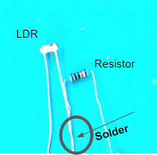
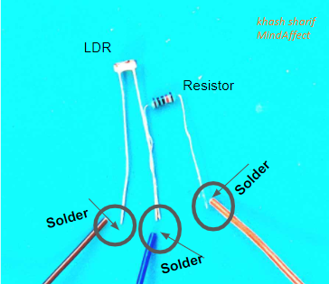
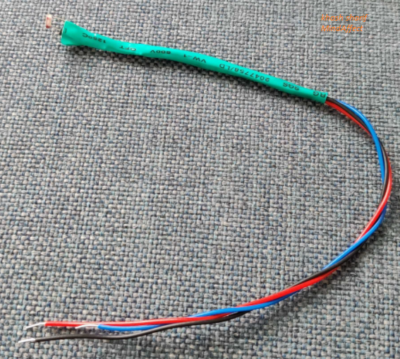

How to build your own optical sensor
===============
Equipment
-----
* basic soldering kit
   * Soldering iron
   * Soldering tin
   * Soldering mat
   * Wires with 3 different colors
* 100k ohm resistor
* photoresistor(LDR) 
   * GL5528 LDR or GL5537 LDR
* 3v DC power supply of your choice
* 2x AAA batteries in parallel
* 3v GPIO pins of the OpenBCI board
* 3v LiPo battery 

Circuit design concept
-----
The circuit is a simple voltage divider, consisting of a number resistor and a LDR. The LDR’s resistance is a function of light exposure. The resistance is reciprocally proportional to light intensity. Thus, by exposing the LDR to any of the visual noise tags (e.g. the flickering buttons on the screen of your computer) The output voltage mimics the behavior of the flickering pattern.

Steps to build the sensor
-----
#. Solder the resistor and the LDR together.
 

#. Solder the red, blue and black wires as demonstrated below.

#. Add shrink tubes at the soldering locations and apply heat to insulate the connections.
#. You have yourself an optical sensor!

