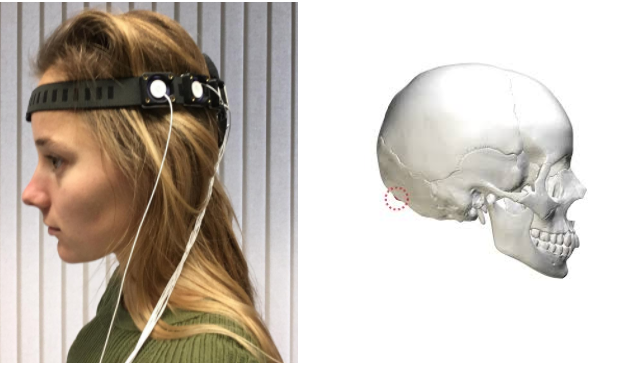

.. _fittingRef:

Set-up & fitting of MindAffect **water** electrodes
===================================================

Set-up
------
To prepare the headset:

1. Get a glass of water
2. Fill the plastic syringe with water
3. Roll the sponges to fit into the headset
4. Put the sponges in the electrode cups in the headset. 
5. Wet the sponges from the top with the syringe with water. Make sure to fill them until they are saturated. This can be detected when water doesn't get absorbed by the sponges anymore.

.. image:: images/setup.png

Fitting
-------

Before positioning the headset on the user’s head, inspect it to see if there are no damaged parts that might hurt the user. 
Please remove any metal parts in the hair (hair clips, ornaments, etc). Please note that the picture on the left contains an older version of the headset. The newer versions have the logo displayed on the left instead of the outer left electrode in the images. 
When using the system with several users or when the headset has become soiled, you can clean the headset using a moistened (by water) cloth. Do not use detergents, as this might damage the electrodes. 
The headset needs to be placed directly above the inion (a small protrusion at the back of the skull).

- Put the hard part of the headset on the back of the head with the electrode cables facing downwards (see image on the left upper corner).
- Tighten the strap on the front of the head to make sure the headset stays in place (not too tight that it gets uncomfortable). 
- Press all electrodes carefully on the head by pressing the white circle plates. The participant must feel it is wet. 
- If the cables were disconnected from the green connector plate, please connect the cables to the right number displayed next to the plugs on the green connector 
- Connect the connector to the OpenBCI amplifier with ‘BCI top’ test facing upwards (such that channel 2,4 and ground are facing upwards as well).

