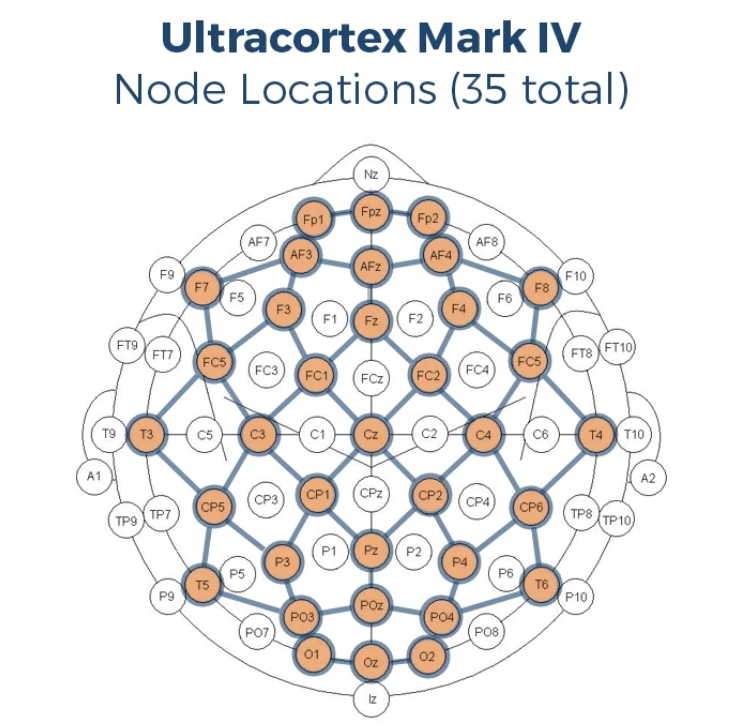

Headset layout
==============

Brain-Computer Interfaces (BCIs) allow users to control devices and communicate by
using brain activity only. BCIs based on broad-band visual stimulation can outperform
BCIs using other stimulation paradigms. Visual stimulation with pseudo-random
bit-sequences evokes specific code-modulated Visual Evoked Potentials (cVEPs) that can
be reliably used in BCI for high-speed communication in, for example, speller applications.
The typical response to code-modulated Visual Evoked Potential Brain Computer Interfacing is
strongest in the locations as shown below, where the blue spot has the significant activation.

.. image:: images/response.png

https://doi.org/10.1371/journal.pone.0133797

Our headset is designed such that the bottom electrode is just above the inion, the bump on the
back of your head right above the neck. The electrodes are spaced exactly 4cm apart, this
distance is based on extensive data analysis of acquired EEG signals. The headset used by
MindAffect contains water-based electrodes with AgCl. However, we believe it should work with
typical cup-electrodes or dry electrodes when the connections are made right.

MindAffect headset
------------------

For the Ganglion we only use 4 working electrodes, located in a row approximately 1cm above
the inion. They are centered around the reference electrode in the middle (median/sagittal
plane), which leads to two electrodes on the left and two on the right of the reference electrode.
The ground is mounted on the forehead by a conducting headband, however, one can use an
electrode sticker on the forehead, a bracelet around the wrist or use an electrode as far away as
possible from the brain signals measured.

MarkIV UltraCortex headset
--------------------------

The OpenBCI headset has successfully been tested with the use of the O1, Oz, O2, PO3, POz, PO4, T5, ad T6
electrodes for the signals, one of the earclips for reference and the other earclip for the Ground. 
Consult the image below for the respective locations on the headset.
Please note that only a handful of tests have been conducted with this headset, and the
electrodes might not be optimal. Also, note that the headset uses dry electrodes, this
might induce longer classification times.

